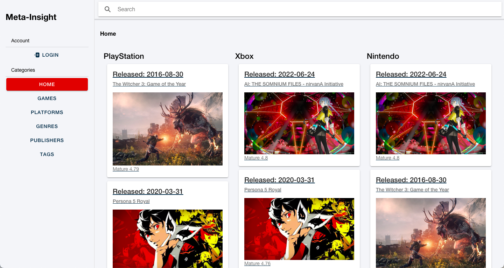

  # Meta Insight
  
  ## Description 
  Meta-Insight is a social game review website, you can create an account, authenticate, view games, view reviews, submit your own reviews, and view a dashboard of all your current reviews.
  
  ## Table of Contents
  * [Technology Stack](#technology-stack)
  * [User Story](#user-story)
  * [Installation](#installation)
  * [Screenshot](#screenshot)
  * [Deployed Page](#deployed-page)
  * [The Team](#the-team)
  * [The Team Tasks](#the-team-tasks)
  * [Outside Resources](#outside-resources)
  * [License](#license)

  ## Technology Stack


  ## User Story
  ```md
    TODO: Add User Story
  ```
  
  ## Installation 

  ```node
    import schema.sql into MySQL Workbench
    npm install
    node seeds/seed.js
    npm start
  ```

  ## Screenshot
  
  
  
  ## Deployed page

  [Meta Insight](https://meta-insight.herokuapp.com/)

  ## The Team

  [Joshua Cavell](https://github.com/xclusive36)  
  [Dylan Wednieski](https://github.com/iam3dski)  
  [Erin Keller](https://github.com/erin-m-keller)

  ## Contributor

  [Kevin Rhode](https://github.com/KevinRhode)  

  ## The Team Tasks 

  **Joshua Cavell**: Wireframe, indexRoutes, fetchRoutes, page views,colors, dark mode colors, Things here and there  
  **Dylan Wedniswki**:   
  **Erin Keller**: Authentication/account creation, login/signup page, review functionality, my reviews dashboard page

  ## Outside Resources

  [axios](https://www.npmjs.com/package/axios)  
  [bcrypt](https://www.npmjs.com/package/bcrypt)  
  [connect-session-sequelize](https://www.npmjs.com/package/connect-session-sequelize)  
  [dotenv](https://www.npmjs.com/package/dotenv)  
  [express](https://www.npmjs.com/package/express)  
  [express-handlebars](https://www.npmjs.com/package/express-handlebars)  
  [express-session](https://www.npmjs.com/package/express-session)  
  [mysql2](https://www.npmjs.com/package/mysql2)  
  [node-fetch](https://www.npmjs.com/package/node-fetch)  
  [moment](https://www.npmjs.com/package/moment)  
  [sequelize](https://www.npmjs.com/package/sequelize)  
  [ionic](https://ionicframework.com/)  
  
  ## License 
  [](https://lbesson.mit-license.org/)